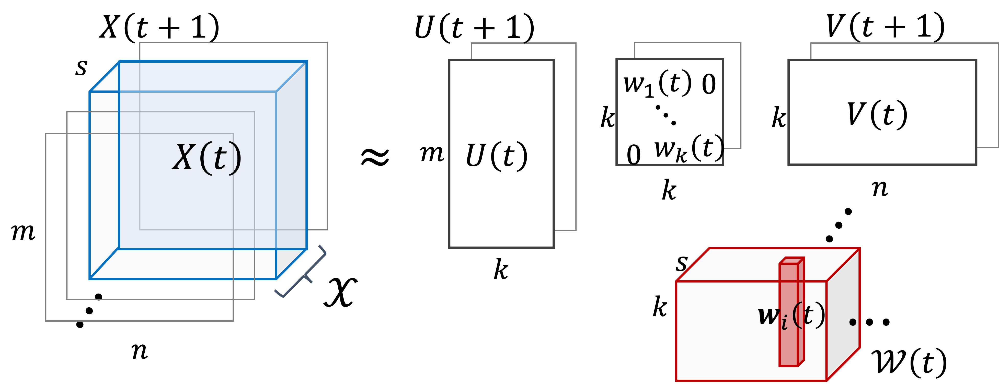

# SSMF

Implementation of [SSMF: Shifting Seasonal Matrix Factorization](http://arxiv.org/abs/2110.12763),
Koki Kawabata, Siddharth Bhatia, Rui Liu, Mohit Wadhwa, Bryan Hooi.
[NeurIPS](https://nips.cc/), 2021.

<!-- ## Model -->



<!-- $$ X(t)\sim U(t)W_{i}(t)V^{\mathsf{T}}(t)$$ -->
<!-- SSMF forecasts future events by -->
<!-- $$ X$$ -->


## DEMO

- Please RUN `python3 ssmf.py`, which starts processing DISEASE dataset and produces the SSMF results into "out" directory.  
- Also, please RUN `python3 ssmf.py --max_regimes 1` to compare its performance with SMF, which does not assume regime shifts.

## Input for SSMF

SSMF expects 3-dimensional `numpy.ndarray`, whose last dimension corresponds to time points. If you have multi-column dataframes, `utils.list2tensor` helps convert your data to 3-dimensional array.

## Commnad line options

- `--output_dir`:  
    Path of output directory (default: 'out')
- `--periodicity`:  
    Length of periodicity (default: 52, for yearly patterns of weekly data)
- `--n_components`:  
    Rank of matrix factorization (default: 10)
- `--max_regimes`:  
    Maximum number of regimes (default: 50, set at 1 for SMF)
- `--learning_rate`:  
    Size of gradient steps in each update (default: 0.2)
- `--max_iter`:  
    Number of iterations to estimate new regimes (default: 1)
- `--float_cost`:  
    Number of bits in MDL (default: 32)
- `--update_freq`:  
    Interval of regime estimation (default: 1)

## Datasets
- Please download at:  
    https://s3.amazonaws.com/tripdata/index.html
- Please download at:  
    https://www1.nyc.gov/site/tlc/about/tlc-trip-record-data.page
- Disease: data/project_tycho.csv.gz. The original data can be found at:  
    https://www.tycho.pitt.edu/data/

## Citation

If you use this code for your research, please consider citing our paper.

```bibtex
@inproceedings{kawabata2021ssmf,
    title={SSMF: Shifting Seasonal Matrix Factorization},
    author={Koki Kawabata, Siddharth Bhatia, Rui Liu, Mohit Wadhwa, Bryan Hooi},
    booktitle={NeurIPS},
    year={2021}

```